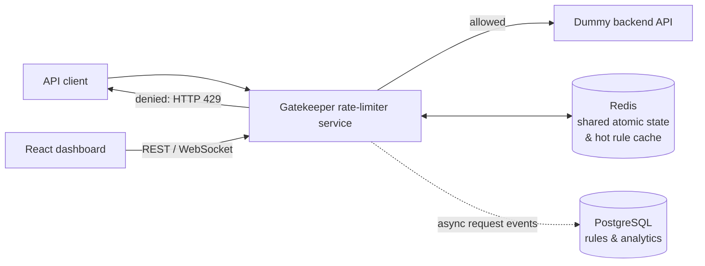

# Architecture overview

Request decisions are synchronous and must be atomic in Redis. Persisting analytics must never delay a decision; event logging will therefore be asynchronous. PostgreSQL is authoritative for rate-limit rules, while Redis caches hot rules and holds algorithm state.

The protected dummy endpoint is intentionally small. It exists to prove that Gatekeeper can enforce a rule before work reaches an upstream API.
